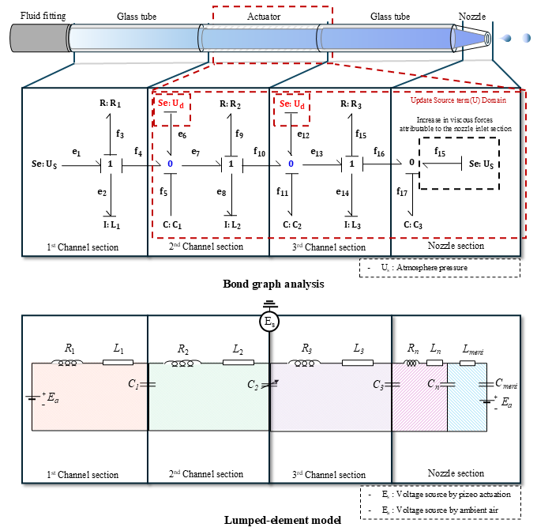

# **A Study on the Flow Characteristics of a Piezoelectric Inkjet**

Piezoelectric inkjet technology enables the precise generation of micro-scale droplets and has been increasingly applied in printing, electronics manufacturing, and advanced material deposition. However, the jetting stability is strongly influenced by ink properties, nozzle geometry, and piezoelectric driving conditions. If the piezoelectric actuator does not provide a sufficient volumetric flowrate, defective droplet formation may occur. Accordingly, a stability analysis considering the overall operating conditions is required. In this study, a lumped element model was established to predict the volumetric flowrate of a piezoelectric inkjet system. Using the proposed model, the flow characteristics at the nozzle were analyzed according to ink properties, nozzle geometry, and applied voltage. The results confirmed that the volumetric flow behavior was highly dependent on these parameters, and the operating conditions associated with improved stability were identified from the best-case condition. This study provides a useful basis for predicting stable operating conditions in piezoelectric inkjet systems.

  

<strong>Fig 1. Equivalent-circuit schematic of the lumped-element model</strong>

